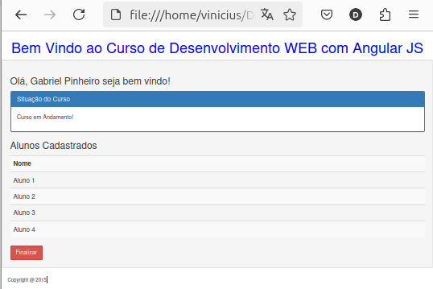

# Estudos de Angular da MOOCS GGTE Unicamp


```
AngularJS v1.3.15 (2010-2014) Descontinuado.
Bootstrap v0.12.1 (2015)
```

Repositorio: https://github.com/ViniciusVC/curso_angular_moocs_ggte_unicamp_aula_3

Site do curso : https://moocs.ggte.unicamp.br/course/desenvolvimento-web-com-angularjs/



# Dados
```
Os dados desta aplicação estão no arquivo controller "primeiro-controller.js".
```

## ng-app
Define o componente raiz.

Ex.:
```
<body class="contanier" ng-app="aplicacao">
```

## ng-show

Exibe um elemento HTML caso a expressão informada seja VERDADEIRA.

Ex.:
```
Tag:
<p ng-show="iniciado">Curso em Andamento!</p>

Script:
$scope.iniciar = function() {
	$scope.iniciado = true;
};
```

## ng-hide

Esconde um elemento HTML caso a expressão informada seja VERDADEIRA.

Ex.:
```
Tag:
<p ng-hide="iniciado">Curso Finalizado!</p>

Script:
$scope.iniciar = function() {
	$scope.iniciado = true;
};
```

## ng-if
Remove um ele elemento DOM caso a expressão informada seja VERDADEIRA.

Ex.:
```
<p ng-if="!iniciado">Aguarde o próximo curso!</p>
```

## ng-repeat

Repete um bloco de html usando um array.
Equivale um forit.

Ex.:
```
<tr ng-repeat="aluno in alunos">
```

## ng-click

Roda uma função ao clicar no componente.

O ng-click pode ser usado em qualquer componente.

ex.:
```
<button ng-show="iniciado" ng-click="finalizar()" class="btn btn-danger">
```

## ng-class
Aplica uma class CSS a um componente.

ex.: 
```
<div ng-class="{'panel panel-primary':iniciado, 'panel panel-danger':!iniciado}">
```

## ng-readonly
Bloquei o campo para edição, se a condição for verdadeira.

## ng-disabled
Bloquei o botão se a condição for verdadeira.

ex.:
```
<button ng-click="submeter()" ng-disabled="!iniciado">
```

## Filters/Filtros

currency é um filter que transforma o numero em valor monetario.

Ex.:
```
{{valor | currency : 'R$'}}
ou
$filter('currency')(valor, 'R$')
```