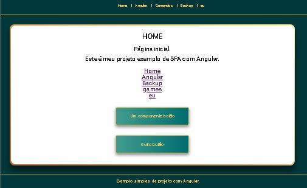

# Projeto Angular Teste1

Primeiro teste com Angular. Criado em 25/01/2024.

# Rodar projeto em desenvolvimento

Para rodar um servidor de desenvolvimento. 

> ng serve

Navegue até `http://localhost:4200/`. O aplicativo será recarregado automaticamente se você alterar algum dos arquivos de origem.





## Para rodar o projeto em outra prota:

> ng serve --port 3333 -o


### Instalando Angular version 17.1.0.

>sudo npm install -g @angular/cli@17

ou

>npm install -g @angular/cli


### Verifique a versão do angular que foi instalada.

> ng version

ou

> ng -v

### Criar projeto

>ng new nome_do_projeto

### Estilização CSS

Escolha o tipo de estilização SCSS/Sass/Less : SCSS

## Criar componente

> ng generate component nome-do-componente

para gerar um novo componente. Você também pode usar 

> ng generate directive|pipe|service|class|guard|interface|enum|module

abreviado 

> ng g c pasta/nomecomponente`.

## Build

Execute `ng build` para construir o projeto. Os artefatos de construção serão armazenados no diretório `dist/`.


# Estrutura Angular
```
📂 /src
│
├── 📂 /enviroments/
│     (senhas, strings de coneção...)
├── 📂 /assets/ 
│     (Imagens)
├── 📂 /app/ 
     │(Porta de entrada da aplicação.) 
     ├── 🌱 -routing.model.ts
     ├── 🌱 .component.html
     ├── 🌱 .component.scrss
     ├── 🌱 .component.spec.ts
     ├── 🌱 .component.ts
     ├── 🌱 .module.ts
```

# Mais
ngOnChanges() : Chama quando imput setado.
ngOnInit() : Chamado quando o componenbte é criado.
ngAfterViewInit() : apois carregar todos os elementos.

