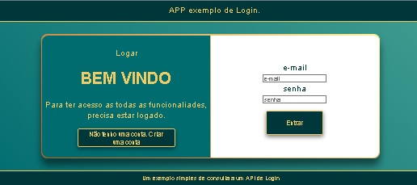

# react_login_avatar

Projeto exemplo React consultando API Pokeapi (sem Next).


Repositorio Github: https://github.com/ViniciusVC/repository_js_public/tree/main/react_login_avatar

## Clonando Projeto

```
git clone https://github.com/ViniciusVC/repository_js_public.git
cd repository_js_public/react_login_avatar
```

# Rodar

Rodar o servidor de desenvolvimento.
>  npm start

http://localhost:3000/ 



## Criando projeto

Criar projeto ReactJS
> npx create-react-app react_login_avatar

Entrar no diretório do projeto.
> cd react_login_avatar

Os codigos estão no diretório /SRC.

## Bibliotecas

Instalar biblioteca de requisição HTTP:
> npm install axios

# API usada para:
```
https://github.com/ViniciusVC/dotnet/tree/main/VVCDotNetAPILogin

 / [GET]
 /logado [GET]
 /register [POST]
 /login [POST]
 /logout [POST]

```


# Build

Quando terminar gere um build.
> npm rum build

Uma pasta Dist será criada.

Copie a pasta DIST o local final da aplicação.

Para acessar o BUILD por um servidor estático:

>  npm install -g serve

>  serve -s build


# Rodar Integrado

1º Entrar no projeto react:
> cd repository_js_public/react_login_avatar
2º Rodar pojeto react em dev.
>  npm start

3º Abrir projeto API DotNet
> cd VVCDotNetAPILogin
4º Rodar pojeto API DotNet
> dotnet run

3º Abrir projeto Proxy Reverso DotNet 
> cd ReverseProxy
4º Rodar pojeto Proxy Reverso DotNet 
> dotnet run

5º Acessar projeto 
> http://localhost:3000/