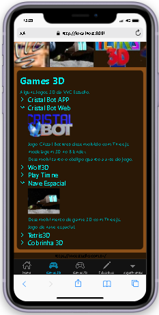
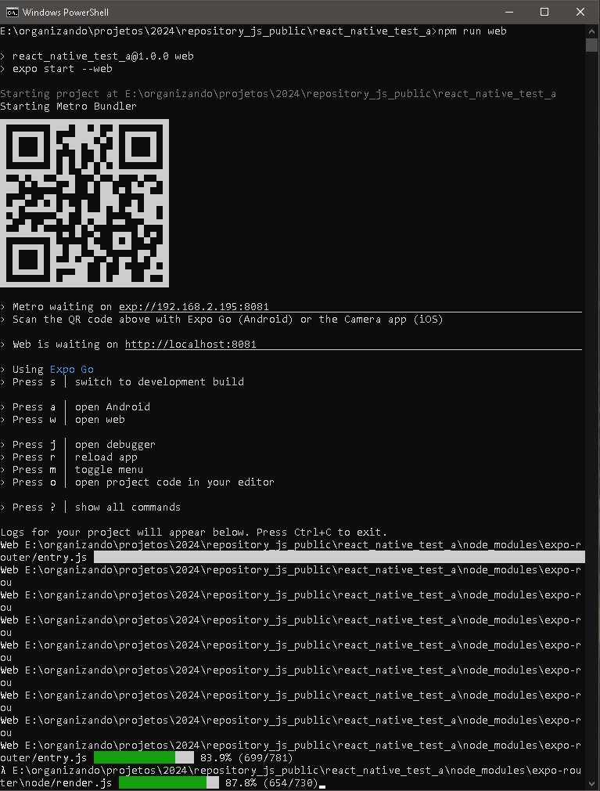

# REACT_NATIVE_TEST_A

Projeto estudo de React Native.

Repositorio Github: https://github.com/ViniciusVC/repository_js_public/react_native_test_a





## Criar Projeto
Iniciar projeto React Native:
```
> npx create-expo-app@latest
What is your app named? ... react_native_test_a
> cd react_native_test_a
```

## Rodar o projeto:
```
> npm run android
> npm run ios # você precisa usar o macOS para construir o projeto iOS - use o aplicativo Expo se precisar fazer o desenvolvimento iOS sem um Mac
> npm run web
```




## Expo Go
> Instale o APP Expo Go no seu celular. Lei o QR Code com a camera o celular.


## Iniciando

Startar o APP

```bash
npx expo start
```


Opções de saida para abrir o aplicativo

- [development build](https://docs.expo.dev/develop/development-builds/introduction/)
- [Android emulator](https://docs.expo.dev/workflow/android-studio-emulator/)
- [iOS simulator](https://docs.expo.dev/workflow/ios-simulator/)
- [Expo Go](https://expo.dev/go), a limited sandbox for trying out app development with Expo

Nota: O projeto usa [file-based routing](https://docs.expo.dev/router/introduction).


