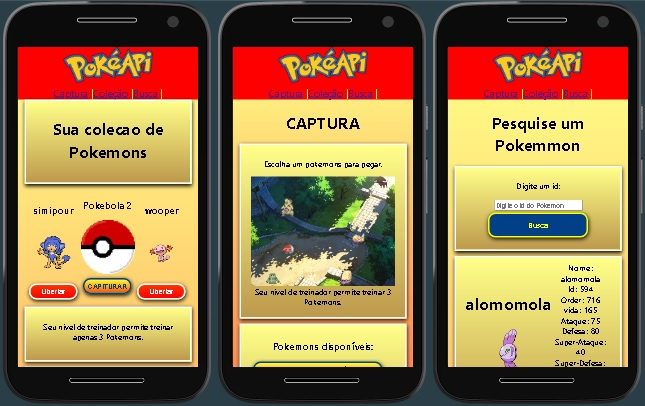

# react_pokemon

Projeto exemplo React consultando API Pokeapi (sem Next).

Repositorio Github: https://github.com/ViniciusVC/repository_js_public/tree/main/eact_pokemon

## Clonando Projeto

```
git clone https://github.com/ViniciusVC/repository_js_public.git
cd repository_js_public/react_pokemon
```

# Rodar

Rodar o servidor de desenvolvimento.
>  npm start

http://localhost:3000/




## Criando projeto

Criar projeto ReactJS
> npx create-react-app react_pokemon

Entrar no diretório do projeto.
> cd react_pokemon

Os codigos estão no diretório /SRC.

Edite os arquivos app.js, index.html e index.js.

## Bibliotecas

Instalar biblioteca de requisição HTTP:
> npm install axios

API usada para:
```
https://pokeapi.co/api/v2/pokemon/{nome do pokemon}

pokemon/ditto, 
pokemon-species/aegislash, 
type/3, 
ability/battle-armor, 
or pokemon?limit=100000&offset=0.
```


# build

Quando terminar gere um build.
> npm rum build

Uma pasta Dist será criada.

Copie a pasta DIST o local final da aplicação.

Para acessar o BUILD por um servidor estático:

>  npm install -g serve

>  serve -s build


# `npm test`

Launches the test runner in the interactive watch mode.\
See the section about [running tests](https://facebook.github.io/create-react-app/docs/running-tests) for more information.
