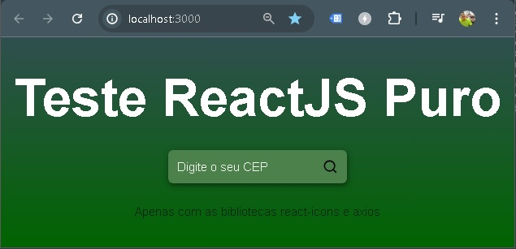

# react_puro_busca

Projeto exemplo React sem Next.

Repositorio Github: https://github.com/ViniciusVC/repository_js_public/tree/main/react_puro_busca

## Clonando Projeto

```
git clone https://github.com/ViniciusVC/repository_js_public.git
cd repository_js_public/react_puro_busca
```

## Criando projeto

Criar projeto ReactJS
> npx create-react-app react_puro_busca

entrar no diretório.

> cd react_puro_busca

Os codigos estão no diretório /SRC.

Edite os arquivos app.js, index.html e index.js.


# Rodar

Rodar o servidor de desenvolvimento.
>  npm start

http://localhost:3000/



# Bibliotecas

Instalar biblioteca Icons
> npm install react-icons

(Veja mais opções de icones em https://react-icons.github.io/react-icons/)

Instalar biblioteca de requisição HTTP:
> npm install axios

API usada para:
> https://viacep.com.br/ws/{numero CEP apenas numeros}/json/


# build

Quando terminar gere um build.
> npm rum build

Uma pasta Dist será criada.

Copie a pasta DIST o local final da aplicação.

Para acessar o BUILD por um servidor estático:

>  npm install -g serve

>  serve -s build
