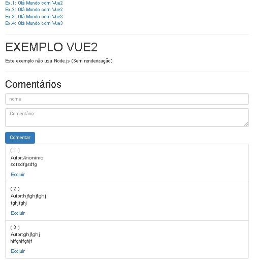

# Exemplo de Vue.JS Classico


Neste projeto
```
Vue.JS 2 e 3. (Não renderizado.)
Bootstrap v0.12.1 (2015)
```




* el: Nome do aplicativo
* data: Variaveis
* methods: Todas as funções
* computed:
* wath: Observador. Executa quando uma alteraçãpo acontece.


## v-for
```
A propriedade v-for incluida em uma divi, 
funcionará como um for in, repetindo os elementos internos.
<div v-for="comment in comments">
ou
<div v-for="(comment, index) in comments">
```
## v-on
```
Capturar o evento de click de um button ou link.
<a v-on:click="nomeDaFuncao(param)">
ou
<a v-on:click.prevent="nomeDaFuncao(param)">
```
## v-model
```
Associar campo com variavel.

```

## ng-app
```
Define o componente raiz.
Ex.:<body class="contanier" ng-app="aplicacao">
```

## ng-show
```
Exibe um elemento HTML caso a expressão informada seja VERDADEIRA.
Ex.:<p ng-show="iniciado">Curso em Andamento!</p>

```

## ng-hide
```
Esconde um elemento HTML caso a expressão informada seja VERDADEIRA.
Ex.:<p ng-hide="iniciado">Curso Finalizado!</p>
```

## ng-if
```
Remove um ele elemento DOM caso a expressão informada seja VERDADEIRA.
Ex.:<p ng-if="!iniciado">Aguarde o próximo curso!</p>
```

## ng-repeat
```
Repete um bloco de html usando um array.
Equivale um forit.
Ex.:<tr ng-repeat="aluno in alunos">
```

## ng-click
```
Roda uma função ao clicar no componente.
ex.: <button ng-show="iniciado" ng-click="finalizar()" class="btn btn-danger">
O ng-click pode ser usado em qualquer componente.
```

## ng-class
```
Aplica uma class CSS a um componente.
ex.: <div ng-class="{'panel panel-primary':iniciado, 'panel panel-danger':!iniciado}">
```

