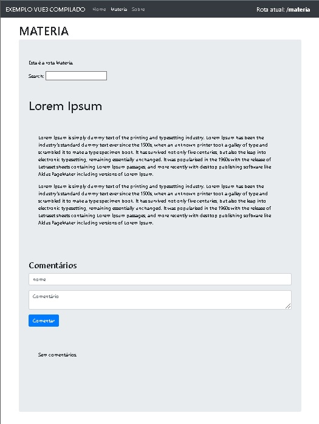

# vue_js_node

Exemplo de SPA com Vue no Node.


### Rodar projeto em desenvolvimento
```
npm run serve
```




## Project setup
```
npm install
```


### Compila e minifica para produção 
```
npm run build
```

### Lints e correções de arquivos
```
npm run lint
```

## No package.json incluir :
> "rules": { "vue/multi-word-component-names": "off" }

### ROTAS
> npm install vue-router

https://router.vuejs.org/guide/